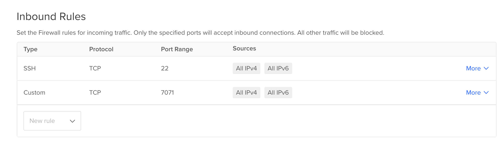
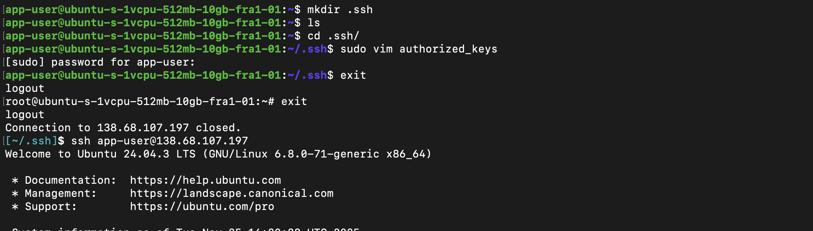

# Module 5

## Overoal Goal

Install and Setup Cloud Server to run an application.

### Create Server (in my case a droplet)

- Minimal Resources are enough
- Use SSH key connection

After initial setup via the Digital Ocean UI, do this at connection method:

`cat ~/.ssh/<NAME-OF-KEY>.pub`

and copy the Public Key accordingly.

By default all ports are open. We need to restrict access to align with best practices

- Modify Firewall Inbound Rules to only accept connections via Port 22(ssh).
- (optional) determine my IP to specify the range within the sources section

After the firewall rules are set use

`ssh root@IP_ADDRESS` + accept fingerprint

to connect to the droplet.

Install Version 8 of Java using

`apt update`
`apt upgrade`
`apt install openjdk-8-jre-headless`

### Deploy and run application

First build Java application locally and then copy to droplet via scp.
Find source code at https://gitlab.com/twn-devops-bootcamp/latest/05-cloud/java-react-example

Use Gradle to build the application

`gradle build`

After successful build secure copy the .jar file from build/libs/java-react-example.jar to droplet.

`scp build/libs/java-react-example.jar root@IP_ADDRESS:/root`

Now it is necessary to open the port at 7071 as tomcat uses it. For that Firewall settings have to be modified.

Finally run `java -jar java-react-example.jar &` to run application in detached mode. Now it is possible to reach out for IP_ADDRESS:7071 within any browser to see the simple application.

### Create and configure Linux user on a cloud server

***Security best practice is not to use root user***

- Create separate user for every application
- Give it only permission it needs

So in our case we have to run the application with dedicated user.

First we create a new user

`adduser app-user`

then we add the created user into root group to give execution rights

`usermod -aG sudo app-user`

after this we can switch to that user by using

`su - app-user`

#### Setup SSH Login for new created user

We have to copy or create a new SSH Key into users .ssh dir, which we also going to create.

`mkdir .ssh`

Now we create a file to list authorized keys and copy SSH Key public information into that file.

`sudo vim .ssh/authorized_keys`

Finally we can connect onto the droplet directly using the new created user.